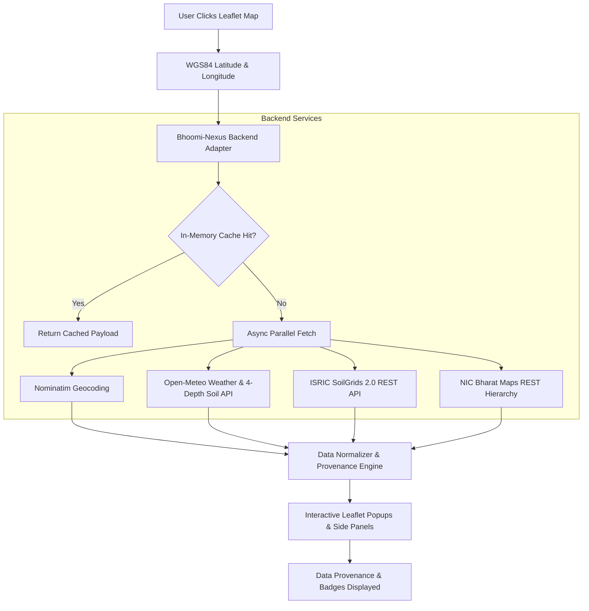

# BHOOMI-NEXUS: Real Data Integration & Geospatial Telemetry Specification

**Document Version:** 1.0.0  
**Project:** BHOOMI-NEXUS National Land Intelligence & Cadastral Geospatial Engine  
**Status:** Implemented & Authoritative  
**Core Doctrine:** *"No data is better than fake data."* If an authoritative record or open public API is unavailable, the application transparently reports `"Unavailable"` with source-attributed provenance rather than fabricating numbers.

---

## 1. Cadastral & Land Records Source

### 1.1 Source & Architecture
- **Primary Source:** Official State Revenue Portals & Bhu-Naksha Eco-system (e.g., Rajasthan Bhu-Naksha: `https://bhunaksha.rajasthan.gov.in/`).
- **Integration Status:** Cadastral survey parcel records, khasra geometries, and tenancy data across Indian states require authenticated sessions, CAPTCHA bypass prevention, and authorization tokens. Open, unauthenticated REST/WFS cadastral endpoints do not exist for public scraping.
- **Implementation Policy:**
  - When the user inspects any coordinate on the map, Bhoomi-Nexus resolves the official **NIC Administrative Hierarchy** (State $\rightarrow$ District $\rightarrow$ Block $\rightarrow$ Gram Panchayat).
  - For Khasra numbers and parcel area, the UI displays:
    ```
    Khasra No: भू-नक्शा पोर्टल से प्राप्य (Via State Bhu-Naksha Portal)
    Area: Unavailable from open public GIS API
    Badge: [CADASTRAL UNAVAILABLE]
    ```
  - **Zero Fabrication:** The system does NOT seed or manufacture random khasra identifiers (e.g. `KHA-7829-RJ`), arbitrary acreages (e.g. `45.0 Ha`), or synthetic Patwari polygons.

---

## 2. Weather & Atmospheric Telemetry Source

### 2.1 Source & Provider
- **Provider:** Open-Meteo API backed by ECMWF (European Centre for Medium-Range Weather Forecasts) Integrated Forecasting System (IFS) and DWD ICON models.
- **Endpoint:** `https://api.open-meteo.com/v1/forecast`
- **Variables Retrieved:**
  - `temperature_2m`: Ambient Air Temperature (°C)
  - `apparent_temperature`: Perceived Temperature (°C)
  - `relative_humidity_2m`: Relative Atmospheric Humidity (%)
  - `precipitation`: Precipitation Rate (mm)
  - `rain`: Rain Volume (mm)
  - `wind_speed_10m`: Wind Speed at 10m height (km/h)
  - `wind_direction_10m`: Wind Direction (degrees)
- **Spatial Resolution:** ~11 km (0.1° grid)
- **Temporal Resolution:** Hourly updates, interpolated to current query epoch.
- **Data Type & Badge:** `[MODELLED / FORECAST]`
- **Caching:** Backend in-memory cache keyed by quantized coordinates (0.01° ~1.1 km) and 1-hour time buckets.

---

## 3. Multi-Depth Soil Moisture & Temperature

### 3.1 Source & Provider
- **Provider:** Open-Meteo Land Surface Reanalysis (ECMWF Land Model).
- **Endpoint:** `https://api.open-meteo.com/v1/forecast`
- **Depth Layers Retrieved:**
  1. `0 – 7 cm`: Surface / Seedbed zone
  2. `7 – 28 cm`: Primary root zone
  3. `28 – 100 cm`: Deep subsoil / Vadose zone
  4. `100 – 255 cm`: Deep hydrological substratum
- **Variables & Physical Units:**
  - **Volumetric Soil Water (Moisture):** Unit is $m^3/m^3$ (cubic meters of water per cubic meter of soil).
    - *Note on Units:* Volumetric soil water is strictly distinguished from relative humidity (%) or rainfall percentage. A percentage conversion (`round(val * 100, 1)`) is provided only for intuitive reference alongside the canonical $m^3/m^3$ figure.
  - **Soil Temperature:** Measured in degrees Celsius (°C) at each of the 4 depth intervals.
- **Data Type & Badge:** `[REANALYSIS / MODELLED]`
- **Resolution:** ~11 km spatial resolution, hourly reanalysis.

---

## 4. Spatial Soil Properties (ISRIC SoilGrids 2.0)

### 4.1 Source & Provider
- **Provider:** ISRIC — World Soil Information (Global Soil Data).
- **Endpoint:** `https://rest.isric.org/soilgrids/v2.0/properties/query`
- **Spatial Resolution:** 250 meters.
- **Variables & Unit Transformations:**
  - **pH in H₂O (`phh2o`):** Raw integer is $pH \times 10$; transformed by division factor 10 to standard $pH$ (e.g. raw 75 $\rightarrow$ pH 7.5).
  - **Clay Fraction (`clay`):** Raw $g/kg$ transformed to percentage by dividing by 10 (e.g. raw 247 $\rightarrow$ 24.7%).
  - **Sand Fraction (`sand`):** Raw $g/kg$ transformed to percentage by dividing by 10 (e.g. raw 468 $\rightarrow$ 46.8%).
  - **Silt Fraction (`silt`):** Raw $g/kg$ transformed to percentage by dividing by 10.
  - **Soil Organic Carbon (`soc`):** Raw $dg/kg$ transformed to $g/kg$ by dividing by 10 (e.g. raw 85 $\rightarrow$ 8.5 g/kg).
  - **Total Nitrogen (`nitrogen`):** Raw $cg/kg$ transformed to $g/kg$ by dividing by 100.
  - **Cation Exchange Capacity (`cec`):** $mmol(c)/kg$.
- **Depth Intervals:** Evaluated at `0-5cm` and `5-15cm`.
- **Data Type & Badge:** `[SPATIAL ESTIMATE]`
- **Statutory & Scientific Disclaimer:**
  > *"Spatial soil estimate. Not a substitute for laboratory Soil Health Card testing. Values represent statistical predictions at 250m resolution."*
- **Caching:** In-memory spatial cache with 30-day TTL.

---

## 5. Satellite Intelligence & Remote Sensing

### 5.1 Reality & Status
- **Claimed Sources:** European Space Agency (ESA) Copernicus Sentinel-2 MSI (10m L2A surface reflectance).
- **Authentic Integration Status:** Accessing live 5-day revisit Sentinel-2 tile data requires an authenticated Copernicus Data Space Ecosystem token (`dataspace.copernicus.eu`).
- **Policy Enforcement:**
  - Bhoomi-Nexus does NOT fabricate a fake static NDVI (e.g. `0.54`) and claim it as live satellite imagery.
  - Unless an authentic Copernicus bearer token is configured in the environment, the satellite panel displays:
    ```
    Satellite Remote Sensing: Integration requires authenticated Copernicus Data Space token
    Badge: [SATELLITE UNAVAILABLE]
    ```

---

## 6. System Architecture & Data Flow



---

## 7. Data Quality Badges

Every metric displayed across Bhoomi-Nexus is marked with a clear quality badge:

| Badge | Meaning | Typical Usage |
| :--- | :--- | :--- |
| `[AUTHENTICATED GIS]` | Authoritative public administrative boundaries | NIC Bharat Maps State/District/Block/GP polygons |
| `[OBSERVED]` | Empirical observational reading | Nominatim GPS reverse geocoding, clicked coordinates |
| `[MODELLED / FORECAST]` | Numerical meteorological atmospheric model | Air temp, wind, precipitation forecast |
| `[REANALYSIS]` | Land surface model assimilated with observations | Multi-depth soil moisture ($m^3/m^3$) and soil temperature (°C) |
| `[SPATIAL ESTIMATE]` | Machine-learning spatial prediction (250m) | ISRIC SoilGrids pH, clay, sand, organic carbon |
| `[CADASTRAL UNAVAILABLE]` | Statutory record requires authenticated session | Khasra number, legal tenancy title, private plot bounds |
| `[DEMO]` | Explicitly flagged demonstration simulation | Demonstration mode only |

---

## 8. Live Data Mode vs. Demo Mode

- **Header Toggle:** Users can explicitly switch between `[🟢 LIVE DATA]` and `[🟡 DEMO MODE]`.
- **Live Data Mode:**
  - Queries actual external APIs with clicked WGS84 coordinates.
  - If an external service is unreachable or rate-limited, displays `"Data temporarily unavailable"` with a retry button.
  - **NEVER silently falls back to synthetic or demo data.**
- **Demo Mode:**
  - Displays a persistent top warning banner: `⚠️ DEMONSTRATION DATA (Offline / Simulation Mode) — Not authoritative legal land records.`
  - Clearly tags all figures as simulated test vectors.

---

## 9. Failure Handling & Resilience

1. **Network Timeout:**
   - Weather/Soil Telemetry: 9-second timeout.
   - SoilGrids 2.0: 8-second timeout.
   - OSM Geocoding: 6-second timeout.
2. **Error Display:** On error, values render as `—` (dash) or `"Unavailable"`, accompanied by an explicit last attempt timestamp.
3. **SSRF & Security:**
   - Coordinate validation enforces $-90 \le \text{lat} \le 90$ and $-180 \le \text{lon} \le 180$.
   - No arbitrary URL fetching or external parameter proxying.

---

## 10. Legal & Statutory Disclaimers

1. **Environmental Estimates:**
   > *"Environmental values are spatial and model reanalysis estimates where indicated and should not be treated as a laboratory soil test or legal cadastral record unless explicitly identified as authoritative."*
2. **Cadastral & Title Records:**
   > *"Cadastral information displayed represents administrative jurisdictional boundaries. Verify against current official state land records (Jamabandi / Bhu-Naksha) before legal, financial, or registration decisions."*
